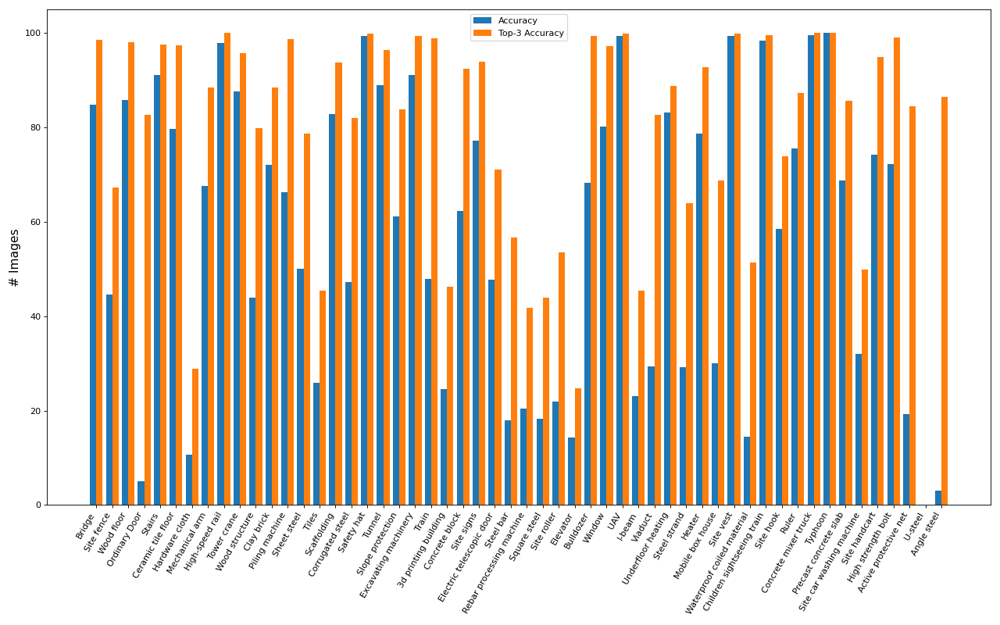

# VL-Con

This is the repository to download our collected image-text pairs based on Uniformat using `clip-retrieval` or through web searching. Please refer to the following instruction to download the datasets and reproduce our work. 


## Datasets

### Uniformat Acitivities

This work is based on CSI UniFormat 2010, which can be downloaded from [here](https://graphisoft.com/downloads/archicad/BIM_Data?) as `2010 CSI UniFormat`. After downloading the `.xml` file from the website, you could then use the following codes to parse the activities as shown in the below.

```python
# >> pip install xmltodict

# read xml
uniformat_dict_list = None
with open('Uniformat_2010_CSI.xml', 'r') as f:
    tmp = xmltodict.parse(f.read())
    uniformat_dict_list = tmp['BuildingInformation']['Classification']['System']['Items']['Item']

uniformat_activities = []
def __parse_activity_name(activity_dict):
    ID = activity_dict['ID']
    if ID[0] not in ['A', 'B', 'C', 'D', 'E', 'F', 'G']:
        return
    Name = activity_dict['Name']
    uniformat_activities.append(f'{ID}_{Name}')
    if 'Children' in activity_dict.keys():
        child_dicts = activity_dict['Children']['Item']
        if not isinstance(child_dicts, list):
            child_dicts = [child_dicts]
        for child_dict in child_dicts:
            __parse_activity_name(child_dict)
_ = list(map(__parse_activity_name, uniformat_dict_list))

# `uniformat_activities` contains the list of the activity names
```

### [`clip-retrieval`](https://github.com/rom1504/clip-retrieval)

In this part, we mainly play around with different prompts and automatically download the top **10** retrieved images (based on the similarity score) for each prompt. Before that, we first use two contextless text queries to construct two different datasets having at most ten images for each activitiy. To study the retrieval performance, the datasets are labeled as `0: incorrect`,  `1: incorrect but construction related`, and `2: correct`. We provide the downloading script to demonstrate the usage of `clip-retrieval` for collecting image-text pairs.

```
python image_downloading.py
```

After that, the final dataset using three different prompts are created and manually reviewed to remove the incorrect ones. The searching results from the previous clip-retrieval as json files are also provided under the `data` folder. Feel free to directly load these files in the downloading script without doing the queries again.

<center>

| Prompt   | Image # | Description| <center><div style="width:50px">Link</div></center>  |
| -------- | ------- | ------- | ------- |
| `<activity_name>`  | <center>**6146**</center> | <div style="width:400px">this is our first attempt that directly uses the activity names in Uniformat as a contextless prompt</div>  | <center>\[[IMAGES](https://drive.google.com/file/d/1eyCTuqLQCvpFceKgURiuQYFAZHYfATMx/view?usp=sharing)\]  \|  \[[CSV](https://drive.google.com/file/d/1A3Fzf4EJsT3Rxc-95DaqMLKLyXYpJ6E3/view?usp=sharing)\]</center> |
| `<activity_name> in construction` | <center>**6212**</center> | <div style="width:400px">similar to the previous one as contextless prompt but adding " in construction" as semantic clues </div> | <center>\[[IMAGES](https://drive.google.com/file/d/1oip_59Mci0ZEci0SSAVqPhPqH7PXMYJl/view?usp=sharing)\]  \|  \[[CSV](https://drive.google.com/file/d/1uDp89F26x1dXvTNkX8KZ9-xEJbieDZDk/view?usp=sharing)\]</center>|
| the proposed 3 prompts <br>(see details in our paper)  | <center>**3363**</center> | <div style="width:400px">this is our final dataset without incorrect images that we think could be the best result one can obtain from a public large-scale dataset as LAION-5B</div>  | <center>\[[IMAGES](https://drive.google.com/file/d/1iVWys52iBfsIyEyZheSVmC47DA8smkoJ/view?usp=sharing)\]</center> |

</center>

*As the domain gap inevitably causes the performance degradtion, we found that the original CLIP model used to extract text embedding cannot find images for every activity. To further establish the dataset of certain quantity and quality, we maually collect addition 5 images per activity through web searching as elaborated in the following.

### Web searching

We inspect all the activities and try our best collecting **5** images at the highest variety (i.e., different construction phases) for each of them. The dataset consists of 142 out of 641 activities because the others are considered ambiguous/abstract. The reason can also be why `clip-retrieval` is not working as expected. Note that all the images can be downloaded through web searching. To prevent any copyright issues, we instead provided the original website links for those images, which would be $142\times 5=710$ in total. This process might take you about 2 hours to reproduce the same dataset as ours. The links are saved in a csv file and can be downloaded [here](data/manual-web-searching.csv).


## Codes

### Retrieving images from LAION-5B 


### Zero-shot performance

In this experiment, we validate the domain gap between general cases and construction semantics. We simply use the prompt `A photo of <object_name>` to perform zero-shot classification. The [BCS dataset](https://github.com/xuanhaocheng/BCS-dataset/) is used to evaluate the zero-shot performance of the CLIP model (note that the dataset is available upon the request to the corresponding author). The below figure presents the zero-shot performance (accuracy and top-3 accuracy) of the CLIP model over different classes.



### Construction image semantic classifier

## BibTex citation

Please consider citing our work if you use any code or data from this repo or ideas presented in the paper:

```
```